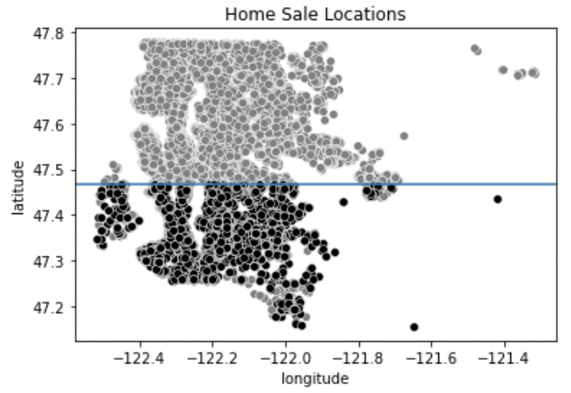
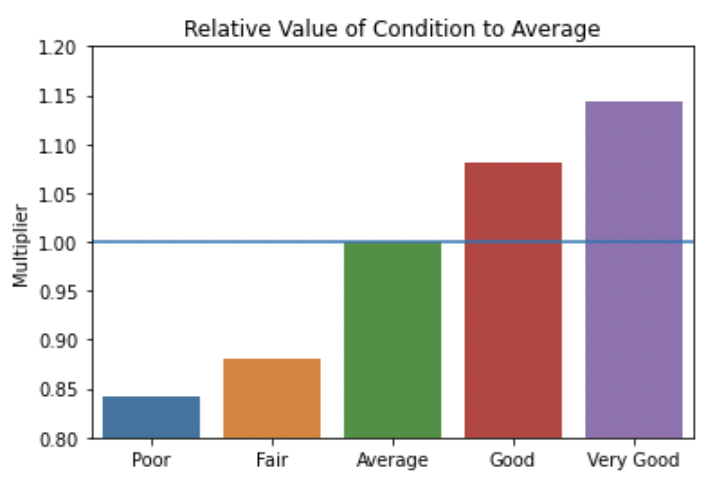
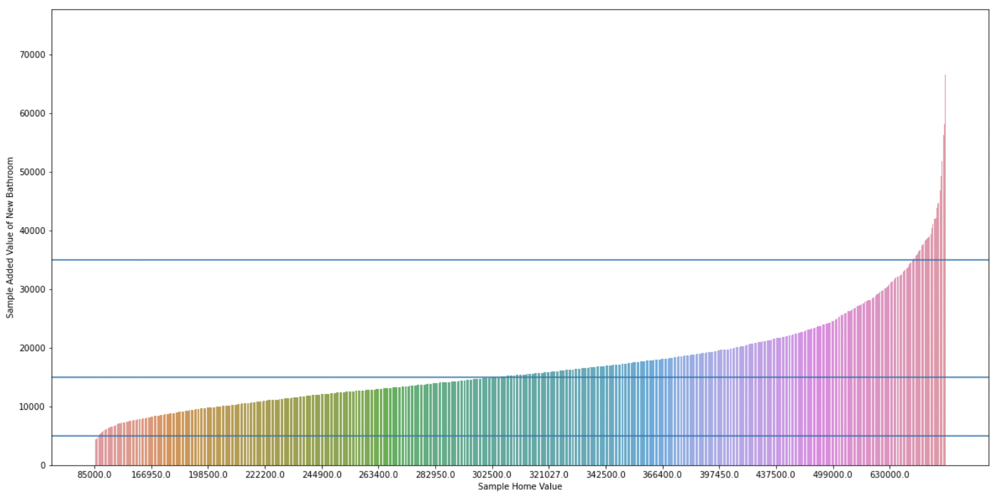

# Introduction

**Author**: Amelia Dobronyi  
**Pace**: Flex  
**Instructor**: Abhineet Kulkarni  

## Overview

This presentation presents recommendations for an individual real estate investor based on an inferential model of real estate transactions in King County.

## Business Objective

Microsoft needs concrete recommendations to determine how they should proceed to make films.

To evaluate the success of its films, and the business unit as a whole, Microsoft should look at return on investment, or ROI.

## Data

The data used was: production budget and box office results, box office results by studio, movie ratings and popularity metrics, and key persons and genre information.

## Recommendation 1

Look to purchase houses in the southern half of the county with no view

## Recommendation 2

Focus on minor improvements to condition

## Recommendation 3

Adding another bathroom makes sense for low-priced homes

## Future Improvements to Analysis

Increase analysis on location by incorporating school districts and local amenities

Consider construction costs to make more concrete improvement recommendations

## Conclusion 

Focus on buying low cost properties: southern half of the county, poor / fair condition, no view

Minimal improvements to condition are incrementally more valuable

Adding a bathroom needs to be considered in the context of total home value

## Repository structure

- technical notebook: student.ipynb
- figures folder
- data set: kc_house_data.csv
- README.md
- presentation.pdf
